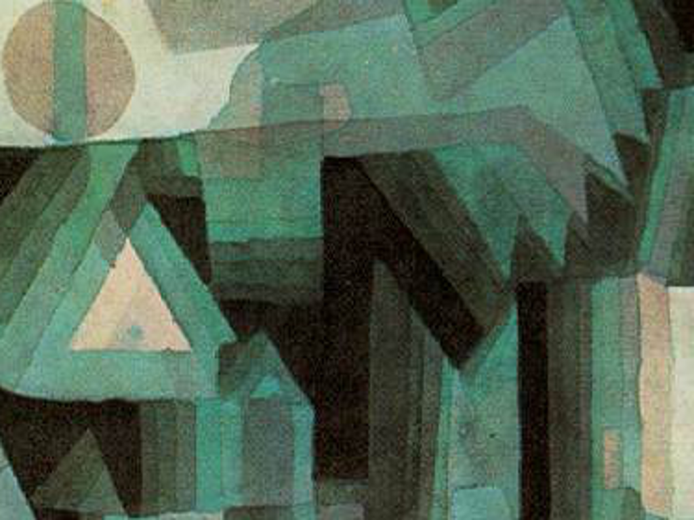

# Assignment 1: Port an Image to Code

#### For this assignment:

Select a crop of Paul Klee's "Dream City" and draw it using p5*js as a 1024 x 768 pixel program. First select an interesting/ambitious crop, then load it into a program such as Photoshop or Illustrator to read the color and coordinate data. Your crop does not have to be 1024x768. You should create the crop, then resize to 1024x768 and use that as your reference. If you don't have access to Photoshop or Illustrator, GIMP is a free cross-platform image manipulation program that can help you find coordinates and color values (coordinates are displayed in the bottom of the window and the Color Picker tool can be used to extract RGB values) . Use integer values for coordinates and only use the following functions for drawing:

- `line()`, `triangle()`, `quad()`, `rect()`, `ellipse()`, and `arc()`.

You must also use the `stroke()`, `fill()`, and `background()`` functions in your sketch as well. Your assignment will be graded on specified code criteria, as well as how accurately your composition and colors match your selected crop.

#### My cropped image:

#### And...

[My final P5*JS sketch](https://stephanie.lol/intro-to-p5js/assignment-1/)
